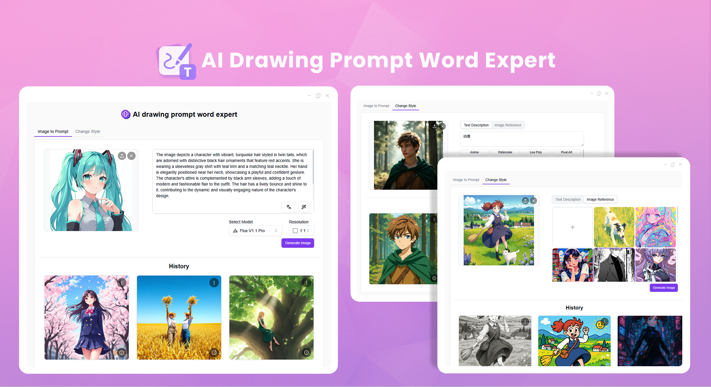
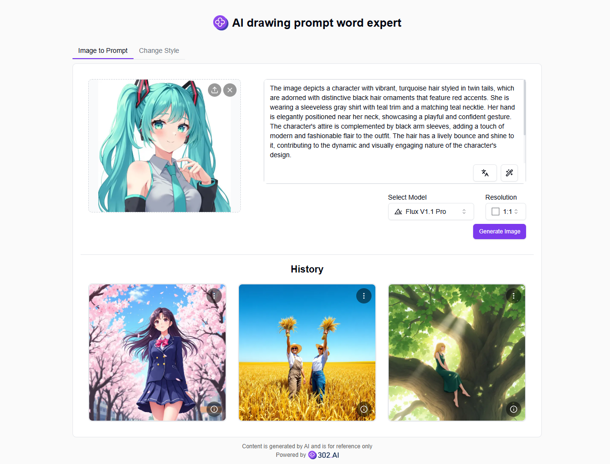
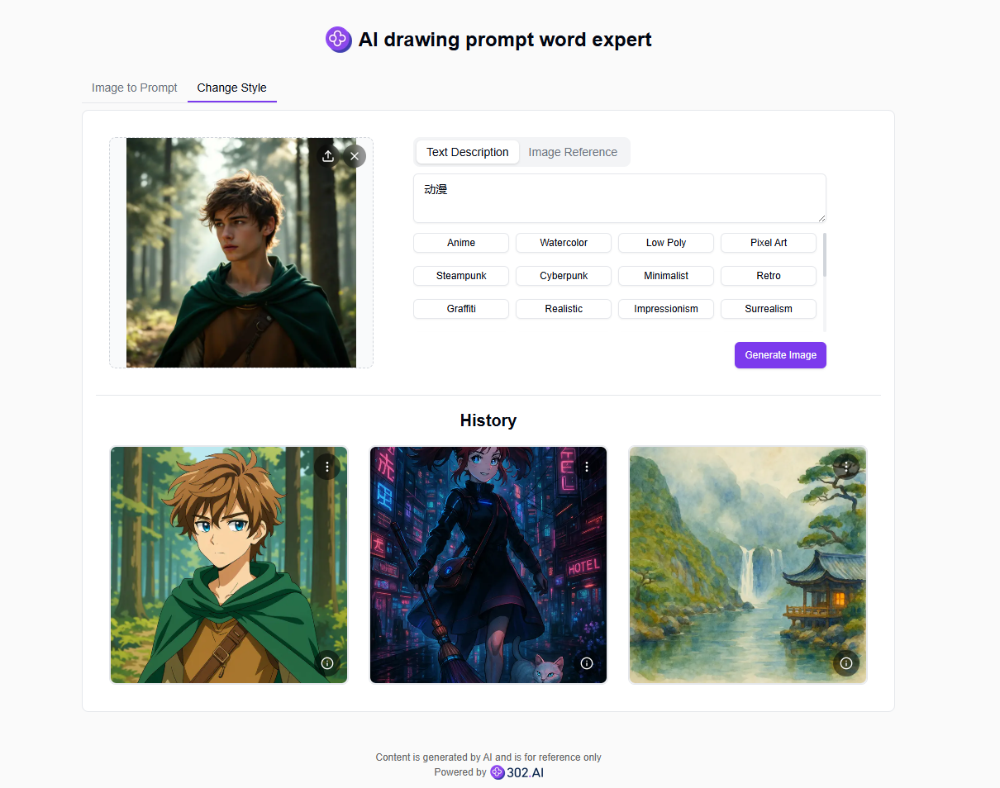
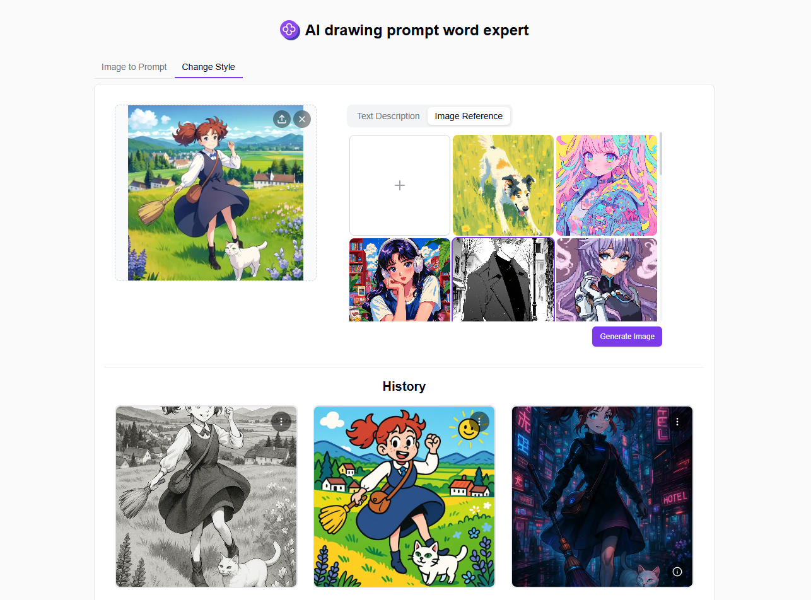

# <p align="center"> 🎨 AI drawing prompt word expert 🚀✨</p>

<p align="center">The AI drawing prompt word expert uses AI to convert images into prompts or modify image styles, providing inspiration, optimization, translation and other auxiliary functions, while supporting one-click text-to-image generation to quickly test prompt effects.</p>

<p align="center"><a href="https://302.ai/en/tools/imgprompt/" target="blank"></a></p >

<p align="center"><a href="README_zh.md">中文</a> | <a href="README.md">English</a> | <a href="README_ja.md">日本語</a></p>



This is the open-source version of the [AI drawing prompt word expert](https://302.ai/en/tools/imgprompt/) from [302.AI](https://302.ai/en/). You can directly log in to 302.AI to use the online version with zero code and zero background, or modify and deploy it yourself according to your requirements.

## Interface Preview
Upload an image to automatically generate prompts based on the image, click to generate images, and quickly test prompt effects. Manual prompt input is also supported.


Select style tags or input style descriptions to modify the image style.
           

Upload an image or select one from the example style images as a reference, then modify the target image style based on this reference image.
     

## Project Features
### 🖼️ Image Analysis
Supports automatic analysis of image content and generates accurate prompts.
### 🎨 Style Conversion
Supports one-click conversion of multiple artistic styles and custom style descriptions.
### 🔄 Reference Image Recreation
Supports uploading reference images for style transfer.
### 📝 Auxiliary Functions
Provides AI optimization, translation, inspiration and other auxiliary functions.
### 🌍 Multi-language Support
- Chinese Interface
- English Interface
- Japanese Interface

## 🚩 Future Update Plans
- [ ] Add more preset artistic styles
- [ ] Support batch image processing

## 🛠️ Tech Stack

- **Framework**: Next.js 14
- **Language**: TypeScript
- **Styling**: TailwindCSS
- **UI Components**: Radix UI
- **State Management**: Jotai
- **Form Handling**: React Hook Form
- **HTTP Client**: ky
- **i18n**: next-intl
- **Theming**: next-themes
- **Code Standards**: ESLint, Prettier
- **Commit Standards**: Husky, Commitlint

## Development & Deployment
1. Clone the project
```bash
git clone https://github.com/302ai/302_ai_drawing_prompt_word_expert
cd 302_ai_drawing_prompt_word_expert
```

2. Install dependencies
```bash
pnpm install
```

3. Configure environment
```bash
cp .env.example .env.local
```
Modify the environment variables in `.env.local` as needed.

4. Start development server
```bash
pnpm dev
```

5. Build for production
```bash
pnpm build
pnpm start
```

## ✨ About 302.AI ✨
[302.AI](https://302.ai/en/) is an enterprise-oriented AI application platform that offers pay-as-you-go services, ready-to-use solutions, and an open-source ecosystem.✨
1. 🧠 Comprehensive AI capabilities: Incorporates the latest in language, image, audio, and video models from leading AI brands.
2. 🚀 Advanced application development: We build genuine AI products, not just simple chatbots.
3. 💰 No monthly fees: All features are pay-per-use, fully accessible, ensuring low entry barriers with high potential.
4. 🛠 Powerful admin dashboard: Designed for teams and SMEs - managed by one, used by many.
5. 🔗 API access for all AI features: All tools are open-source and customizable (in progress).
6. 💡 Powerful development team: Launching 2-3 new applications weekly with daily product updates. Interested developers are welcome to contact us.
