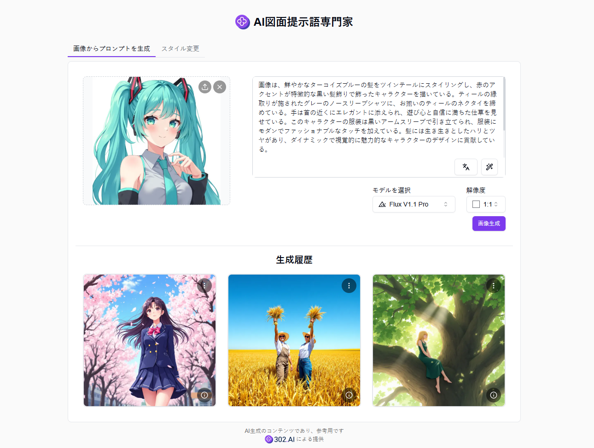

# <p align="center"> 🎨 AI図面提示語専門家 🚀✨</p>

<p align="center">AI図面プロンプトワードエキスパートは、AIを使用して画像をプロンプトに変換したり、画像のスタイルを修正したりします。インスピレーション、最適化、翻訳などの補助機能を提供し、ワンクリックでテキストから画像を生成してプロンプトの効果を素早くテストできます。</p>

<p align="center"><a href="https://302.ai/product/detail/66" target="blank"></a></p >

<p align="center"><a href="README_zh.md">中文</a> | <a href="README.md">English</a> | <a href="README_ja.md">日本語</a></p>


[302.AI](https://302.ai/ja/)の[AI図面提示語専門家](https://302.ai/product/detail/66)のオープンソース版です。
302.AIに直接ログインすることで、コード不要、設定不要のオンライン体験が可能です。
あるいは、このプロジェクトをニーズに合わせてカスタマイズし、302.AIのAPI KEYを統合して、自身でデプロイすることもできます。

## インターフェースプレビュー
画像をアップロードするだけで、自動的に画像からプロンプトを生成し、画像を生成をクリックしてプロンプトの効果を素早くテストできます。また、手動でのプロンプト入力もサポートしています。


スタイルタグを選択するか、スタイルの説明を入力することで、画像のスタイルを修正できます。
           

画像をアップロードするか、サンプルスタイル画像から1枚を参照画像として選択し、その参照画像に基づいて操作画像のスタイルを修正します。
            

## プロジェクトの特徴
### 🖼️ 画像分析
画像の内容を自動分析し、正確なプロンプトを生成します。
### 🎨 スタイル変換
複数のアートスタイルのワンクリック変換とカスタムスタイル記述をサポートします。
### 🔄 参照画像の再現
参照画像をアップロードしてスタイル転送を行うことができます。
### 📝 補助機能
AI最適化、翻訳、インスピレーションなどの補助機能を提供します。
### 🌍 多言語サポート
- 中国語インターフェース
- 英語インターフェース
- 日本語インターフェース

## 🚩 将来のアップデート計画
- [ ] より多くのプリセットアートスタイルの追加
- [ ] バッチ画像処理のサポート

## 🛠️ 技術スタック

- **フレームワーク**: Next.js 14
- **言語**: TypeScript
- **スタイリング**: TailwindCSS
- **UIコンポーネント**: Radix UI
- **状態管理**: Jotai
- **フォーム処理**: React Hook Form
- **HTTPクライアント**: ky
- **国際化**: next-intl
- **テーマ**: next-themes
- **コード規約**: ESLint, Prettier
- **コミット規約**: Husky, Commitlint

## 開発&デプロイ
1. プロジェクトのクローン
```bash
git clone https://github.com/302ai/302_ai_drawing_prompt_word_expert
cd 302_ai_drawing_prompt_word_expert
```

2. 依存関係のインストール
```bash
pnpm install
```

3. 環境設定
```bash
cp .env.example .env.local
```
必要に応じて`.env.local`の環境変数を修正してください。

4. 開発サーバーの起動
```bash
pnpm dev
```

5. プロダクションビルド
```bash
pnpm build
pnpm start
```

## ✨ 302.AIについて ✨
[302.AI](https://302.ai/ja/)は企業向けのAIアプリケーションプラットフォームであり、必要に応じて支払い、すぐに使用できるオープンソースのエコシステムです。✨
1. 🧠 包括的なAI機能：主要AIブランドの最新の言語、画像、音声、ビデオモデルを統合。
2. 🚀 高度なアプリケーション開発：単なるシンプルなチャットボットではなく、本格的なAI製品を構築。
3. 💰 月額料金なし：すべての機能が従量制で、完全にアクセス可能。低い参入障壁と高い可能性を確保。
4. 🛠 強力な管理ダッシュボード：チームやSME向けに設計 - 一人で管理し、多くの人が使用可能。
5. 🔗 すべてのAI機能へのAPIアクセス：すべてのツールはオープンソースでカスタマイズ可能（進行中）。
6. 💪 強力な開発チーム：大規模で高度なスキルを持つ開発者集団。毎週2-3の新しいアプリケーションをリリースし、毎日製品更新を行っています。才能ある開発者の参加を歓迎します。
